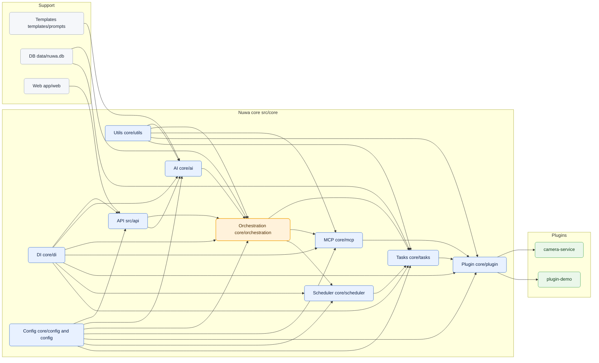

# Nuwa - MCP插件管理平台

一个基于MCP（Model Context Protocol）协议的智能插件管理平台。

## 项目简介

Nuwa是一个现代化的插件管理平台，支持动态加载、管理和执行MCP服务插件。

## 快速开始

### 前置条件

1. Python 3.11+
2. node v20.x
3. npm v9.x

### 服务端启动

#### python

1. 安装依赖：`pip install -r requirements.txt`
2. 启动服务：`python main.py`
3. 访问API文档：`http://localhost:8000/docs`

#### conda

1. 创建环境：`conda create -n nuwa python=3.11`
2. 激活环境：`conda activate nuwa`
3. 安装依赖：`pip install -r requirements.txt`
4. 启动服务：`python main.py`

### 前端启动

1. 安装依赖：`npm install`
2. 启动服务：`npm start`

## 项目架构

### 模块对照（基于 src 目录）

- API 网关: `src/api`
  - 路由：`routers/*`，中间件：`middleware/*`，数据模型：`models/*`
- AI 智能中心: `src/core/ai`
  - 模型提供方：`providers/*`，模型管理：`manager.py`，路由：`router.py`
- 任务编排引擎: `src/core/orchestration`
  - 规划：`planner.py`，插件服务编排：`plugin_service.py`
- MCP 协议层: `src/core/mcp`
  - 协议与RPC：`protocol.py`、`rpc/*`，服务端/客户端：`server.py`、`client.py`、`proxy.py`
- 插件系统: `src/core/plugin`
  - 发现/加载：`discovery.py`、`loader.py`，注册：`registry.py`，校验：`validator.py`，生命周期：`lifecycle.py`
- 调度器: `src/core/scheduler`
  - 任务注册：`register.py`，调度器：`task_scheduler.py`
- 任务执行器: `src/core/tasks`
  - 任务与步骤：`model/*`，执行器：`executor.py`，服务任务：`service_task.py`、`service_step.py`
- 依赖注入: `src/core/di`
  - 启动装配：`bootstrap.py`，容器：`container.py`
- 配置中心: `src/core/config` 与根目录 `config/*.toml`
  - 应用/日志/数据库/AI 配置，统一加载与访问
- 通用工具: `src/core/utils`
  - JSON、时间、模板、插件加载器、结果封装等工具
- 模板与提示词: `templates/prompts/*`
- 数据存储: `data/nuwa.db`
- 前端应用: `app/web`
- 插件仓库: `plugins/*`（示例：`plugins/camera-service`）

