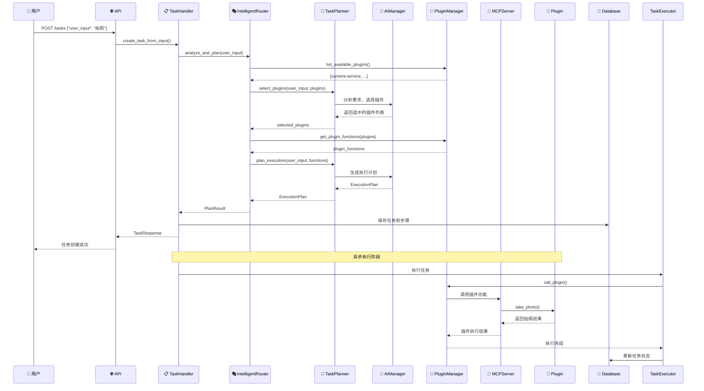

# Nuwa — MCP 插件管理平台

Nuwa 是一个基于 MCP（Model Context Protocol）的智能插件管理与任务编排平台。提供插件热插拔、任务分步执行、AI 智能路由等功能。

## 🚀 核心特性

- **插件系统**：基于MCP协议的插件动态加载与管理
- **任务编排**：智能路由分析用户需求，自动选择合适插件
- **AI 引擎**：集成多AI模型提供商，支持fallback策略
- **分步执行**：任务拆解为多个步骤，支持状态跟踪
- **RESTful API**：完整的API接口，支持前后端分离
- **配置管理**：TOML配置文件，支持多环境部署

## 📁 项目结构

```text
Nuwa/
├── main.py                  # 应用启动入口
├── requirements.txt         # Python 依赖
├── docker-compose.yml       # Docker 编排
├── config/                  # 配置文件
│   ├── application.toml     # 应用配置
│   ├── ai.toml             # AI 模型配置
│   ├── db.toml             # 数据库配置
│   └── logging.toml        # 日志配置
├── src/                     # 核心源码
│   ├── api/                 # API 接口层
│   │   ├── main.py          # FastAPI 应用入口
│   │   ├── routers/         # API 路由
│   │   ├── models/          # 数据模型
│   │   └── middleware/      # 中间件
│   └── core/                # 核心业务层
│       ├── app.py           # 应用管理
│       ├── ai/              # AI 引擎
│       ├── plugin/          # 插件系统
│       ├── mcp/             # MCP 协议
│       ├── tasks/           # 任务处理
│       ├── orchestration/   # 编排引擎
│       ├── config/          # 配置管理
│       └── utils/           # 工具类
├── plugins/                 # MCP 插件目录
│   └── camera-service/      # 示例插件
├── app/web/                 # React 前端
│   ├── src/                 # 前端源码
│   ├── public/              # 静态资源
│   └── package.json         # 前端依赖
├── tests/                   # 测试目录
├── data/                    # 数据文件
└── logs/                    # 日志文件
```

## ⚡ 快速开始

### 环境要求

- **Python**: 3.11+
- **Node.js**: v18+
- **Git**: 版本控制

### 后端启动

```bash
# 1. 克隆项目
git clone <repository-url>
cd Nuwa

# 2. 创建虚拟环境
python -m venv venv
venv\Scripts\activate  # Windows
# source venv/bin/activate  # Linux/macOS

# 3. 安装依赖
pip install -r requirements.txt

# 4. 启动后端
python main.py
```

启动成功后：

- API 文档: <http://localhost:8000/docs>
- 健康检查: <http://localhost:8000/health>
- API 根路径: <http://localhost:8000/api/v1/>

### 前端启动

```bash
# 1. 进入前端目录
cd app/web

# 2. 安装依赖
npm install

# 3. 启动开发服务器
npm start
```

启动成功后：

- Web 应用: <http://localhost:3000>
- 自动代理后端 API 请求到 <http://localhost:8000>

### Docker 部署

```bash
# 构建并启动所有服务
docker-compose up -d --build

# 查看服务状态
docker-compose ps
```

Docker 服务端口：

- 前端: <http://localhost:3000>
- 后端API: <http://localhost:8000>

### 验证安装

#### 1. 后端健康检查

```bash
curl http://localhost:8000/health
```

#### 2. API文档访问

打开浏览器访问: <http://localhost:8000/docs>

#### 3. 前端页面访问

打开浏览器访问: <http://localhost:3000>

#### 4. 测试任务创建

```bash
curl -X POST "http://localhost:8000/api/v1/tasks" \
  -H "Content-Type: application/json" \
  -d '{"user_input": "测试任务", "user_id": "test_user"}'
```

## 🏗️ 系统架构

### 核心组件说明

**API层** (`src/api/`)

- `routers/tasks.py` - 任务管理API，创建、查询、执行任务
- `routers/mcp.py` - MCP插件API，插件状态管理和调用
- `routers/ai_server.py` - AI服务API，模型管理和调用
- `routers/system.py` - 系统监控API，健康检查和系统信息

**核心业务层** (`src/core/`)

- `tasks/task_handler.py` - 任务处理器，负责任务CRUD操作
- `tasks/step_handler.py` - 步骤处理器，管理任务执行步骤
- `tasks/task_executor.py` - 任务执行器，实际执行任务逻辑
- `orchestration/intelligent_router.py` - 智能路由器，分析需求并选择插件
- `orchestration/task_planner.py` - 任务规划器，生成执行计划

**AI引擎** (`src/core/ai/`)

- `manager.py` - AI管理器，统一管理多个AI提供商
- `providers/` - AI提供商实现（OpenAI、Anthropic、DeepSeek等）
- `router.py` - AI路由器，负载均衡和fallback策略

**插件引擎** (`src/core/plugin/`)

- `manager.py` - 插件管理器，插件生命周期管理
- `discovery.py` - 插件发现器，自动扫描插件目录
- `loader.py` - 插件加载器，动态加载插件代码
- `registry.py` - 插件注册表，维护插件状态信息

**MCP协议层** (`src/core/mcp/`)

- `server.py` - MCP服务器，处理MCP协议通信
- `client.py` - MCP客户端，与插件进程通信
- `protocol.py` - MCP协议定义和消息处理

### 系统架构图

```mermaid
graph TB
    subgraph API["🌐 API层"]
        TaskAPI[任务API<br/>tasks.py]
        MCPAPI[插件API<br/>mcp.py] 
        AIAPI[AI服务API<br/>ai_server.py]
        SysAPI[系统API<br/>system.py]
    end
    
    subgraph CORE["⚡ 核心业务层"]
        subgraph TASKS["📋 任务引擎"]
            TaskHandler[TaskHandler<br/>任务处理器]
            StepHandler[StepHandler<br/>步骤处理器]
            TaskExecutor[TaskExecutor<br/>任务执行器]
        end
        
        subgraph ORCHESTRATION["🎭 编排引擎"]
            IntelligentRouter[IntelligentRouter<br/>智能路由器]
            TaskPlanner[TaskPlanner<br/>任务规划器]
        end
    end
    
    subgraph ENGINES["🔧 引擎层"]
        subgraph AI["🤖 AI引擎"]
            AIManager[AIManager<br/>AI管理器]
            OpenAI[OpenAI<br/>提供商]
            Anthropic[Anthropic<br/>提供商]
            DeepSeek[DeepSeek<br/>提供商]
        end
        
        subgraph PLUGIN["🔌 插件引擎"]
            PluginManager[PluginManager<br/>插件管理器]
            PluginDiscovery[PluginDiscovery<br/>插件发现器]
            PluginLoader[PluginLoader<br/>插件加载器]
            PluginRegistry[PluginRegistry<br/>插件注册表]
        end
        
        subgraph MCP["📡 MCP协议"]
            MCPServer[MCPServer<br/>MCP服务器]
            MCPClient[MCPClient<br/>MCP客户端]
        end
    end
    
    subgraph PLUGINS["🧩 插件生态"]
        CameraService[摄像头插件<br/>camera-service]
        CustomPlugin[自定义插件]
    end
    
    subgraph DATA["💾 数据层"]
        Database[(SQLite/PostgreSQL<br/>数据库)]
        Config[配置管理<br/>TOML配置]
    end
    
    %% API层连接
    TaskAPI --> TaskHandler
    MCPAPI --> PluginManager
    AIAPI --> AIManager
    
    %% 业务流程
    TaskHandler --> IntelligentRouter
    IntelligentRouter --> TaskPlanner
    IntelligentRouter --> AIManager
    IntelligentRouter --> PluginManager
    TaskHandler --> StepHandler
    TaskExecutor --> PluginManager
    
    %% AI引擎连接
    AIManager --> OpenAI
    AIManager --> Anthropic
    AIManager --> DeepSeek
    
    %% 插件引擎连接
    PluginManager --> PluginDiscovery
    PluginManager --> PluginLoader
    PluginManager --> PluginRegistry
    PluginManager --> MCPServer
    MCPServer --> MCPClient
    MCPClient --> CameraService
    MCPClient --> CustomPlugin
    
    %% 数据连接
    TaskHandler --> Database
    StepHandler --> Database
    PluginRegistry --> Config
    AIManager --> Config
```



### 工作流程图



## 🧩 插件开发

### 插件结构示例 (camera-service)

```text
plugins/camera-service/
├── __init__.py
├── requirements.txt       # Python依赖
├── pyproject.toml        # 项目配置
├── README.md             # 插件说明
├── core/                 # 核心业务
│   ├── constants.py
│   ├── exceptions.py
│   └── config/
├── interface/            # 接口定义
│   └── camera_interface.py
├── model/                # 数据模型
│   ├── camera.py
│   └── node_model.py
├── services/             # 业务服务
│   └── camera_service.py
├── tools/                # MCP工具定义
│   └── function_schema.json
├── utils/                # 工具类
│   ├── file_path_manager.py
│   ├── media_writer.py
│   └── codec_utils.py
└── tests/                # 测试目录
```

### function_schema.json 示例

```json
[
  {
    "name": "take_photo",
    "description": "拍摄单张照片, 支持自定义文件名、图像质量和临时相机参数覆盖。",
    "input_schema": {
      "type": "object",
      "properties": {
        "filename": {
          "type": "string",
          "description": "照片保存文件名（不含扩展名）。"
        },
        "quality": {
          "type": "number",
          "minimum": 1,
          "maximum": 100,
          "default": 95,
          "description": "JPEG 图像质量等级 (1-100)"
        }
      }
    }
  }
]
```

### 开发步骤

1. **创建插件目录**: 在 `plugins/` 下创建新插件文件夹
2. **定义功能架构**: 参考 `camera-service` 的目录结构
3. **编写 function_schema.json**: 定义插件提供的功能接口
4. **实现业务逻辑**: 在 `services/` 中实现具体功能
5. **配置依赖**: 编写 `requirements.txt` 和 `pyproject.toml`
6. **测试插件**: 在 `tests/` 中编写单元测试

参考现有的 `plugins/camera-service/` 实现。

## 🔧 常见问题

**启动失败**：检查 Python 版本 (>=3.11) 和依赖安装  
**端口占用**：修改 `config/application.toml` 中的端口配置  
**插件加载失败**：检查插件目录结构和功能定义文件  
**API 调用失败**：确认服务启动成功，访问健康检查接口  
**AI调用失败**：检查配置文件中AI提供商的API密钥设置

## 📄 许可证

本项目采用 GPL-3.0 许可证开源。