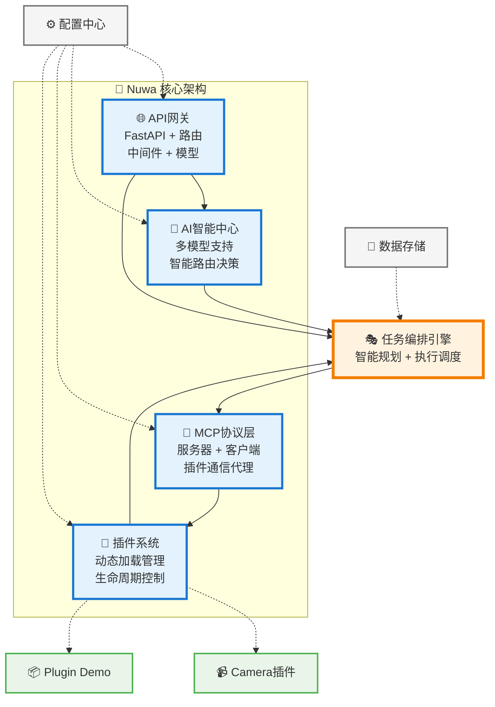

# Nuwa - MCP插件管理平台

一个基于MCP（Model Context Protocol）协议的智能插件管理平台。

## 项目简介

Nuwa是一个现代化的插件管理平台，支持动态加载、管理和执行MCP服务插件。

## 快速开始

### 前置条件

1. Python 3.11+
2. node v20.x
3. npm v9.x

### 服务端启动

#### python

1. 安装依赖：`pip install -r requirements.txt`
2. 启动服务：`python main.py`
3. 访问API文档：`http://localhost:8000/docs`

#### conda

1. 创建环境：`conda create -n nuwa python=3.11`
2. 激活环境：`conda activate nuwa`
3. 安装依赖：`pip install -r requirements.txt`
4. 启动服务：`python main.py`

### 前端启动

1. 安装依赖：`npm install`
2. 启动服务：`npm start`

## 项目架构

