# Nuwa 类图与架构设计文档

本文档提供 Nuwa 项目中各个模块和类的详细类图，便于架构优化和重构分析。

## 📋 目录结构概览

```text
src/
├── api/                    # API 接口层
│   ├── routers/           # API 路由控制器
│   ├── models/            # API 数据模型
│   ├── middleware/        # 中间件
│   └── dependencies.py    # 依赖注入
├── core/                  # 核心业务层
│   ├── orchestration/     # 编排引擎
│   ├── ai/               # AI 管理
│   ├── plugin/           # 插件系统
│   ├── tasks/            # 任务处理
│   ├── mcp/              # MCP 协议
│   ├── config/           # 配置管理
│   ├── di/               # 依赖注入
│   ├── scheduler/        # 任务调度
│   └── utils/            # 工具类
└── tests/                 # 测试代码
```

## 🎭 编排引擎 (Orchestration)

### IntelligentRouter 类图

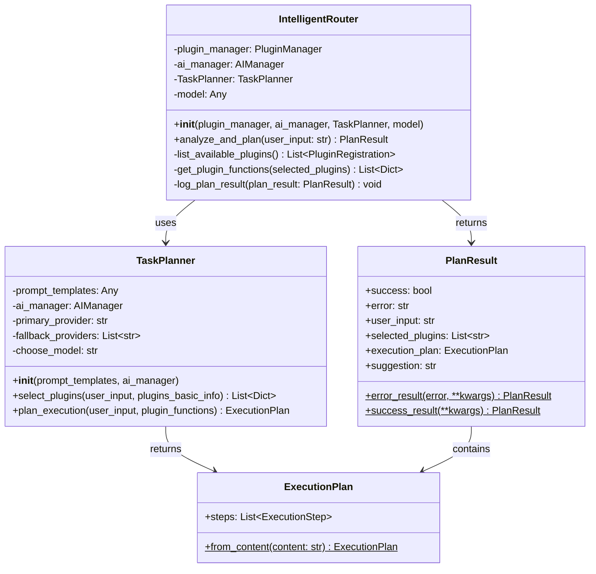

### 编排引擎依赖关系

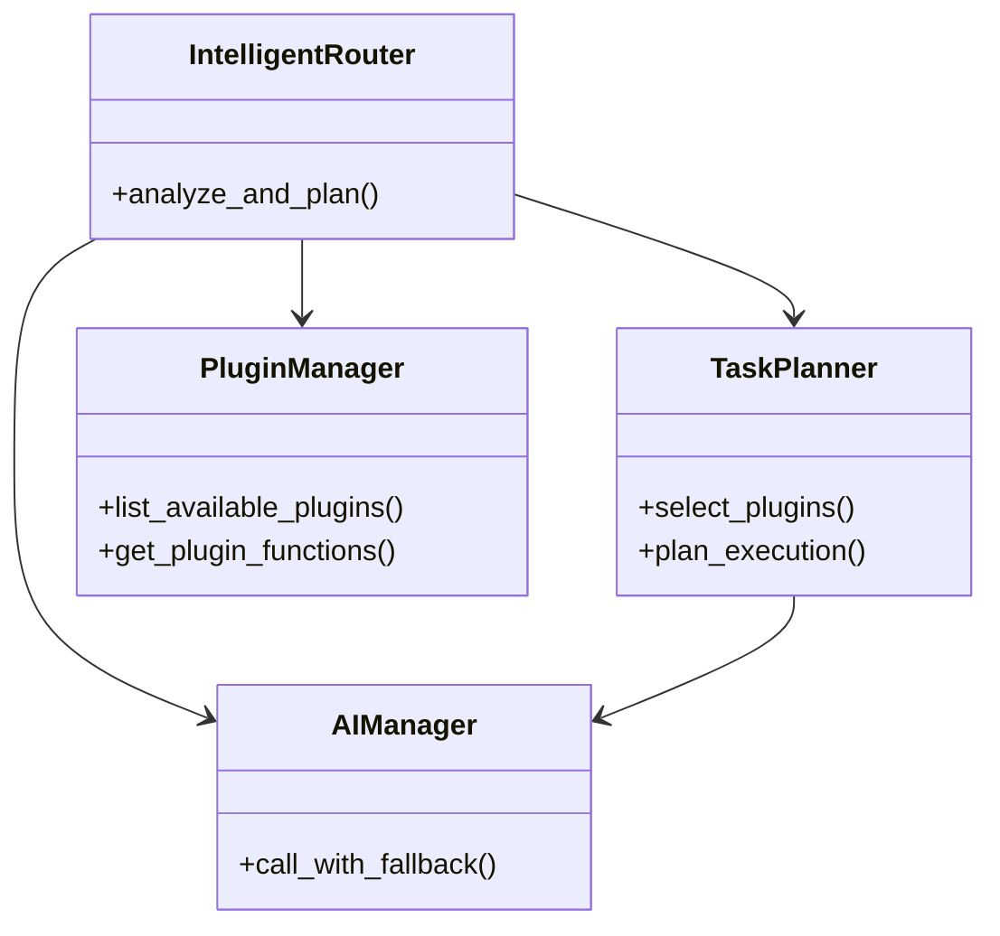

## 🤖 AI 管理模块

### AIManager 类图

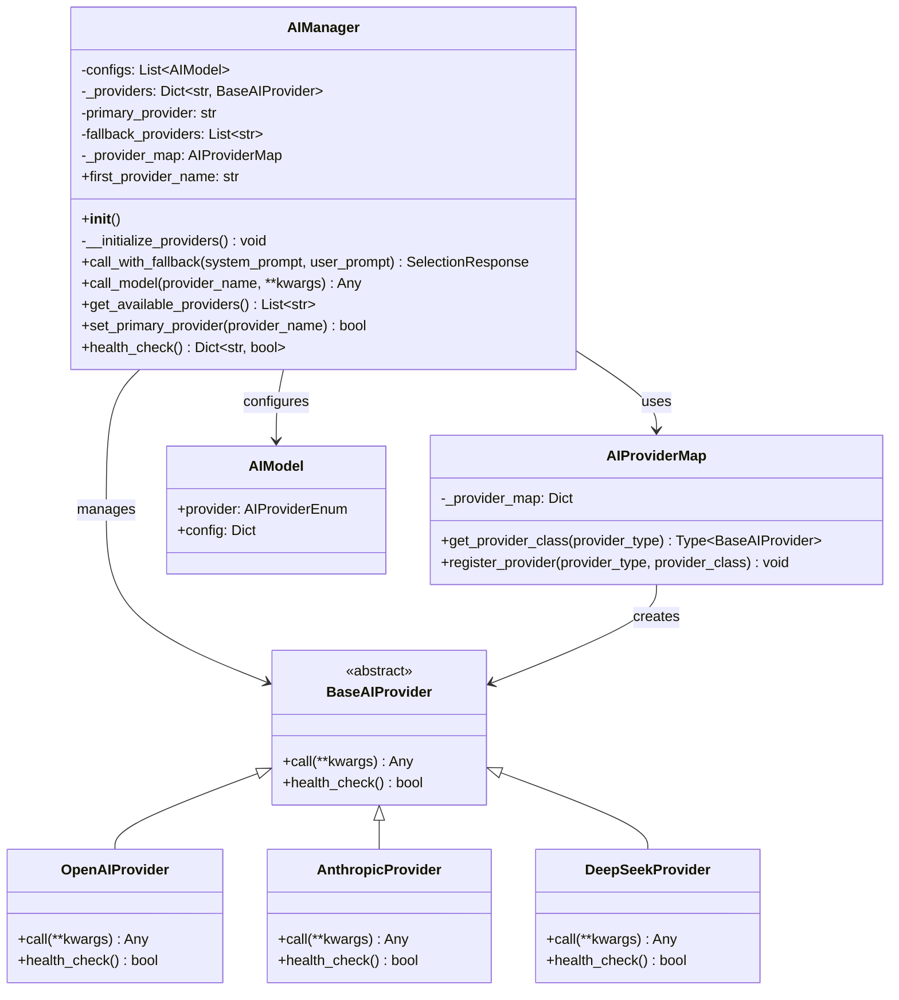

## 🔌 插件系统模块

### 插件管理核心类图

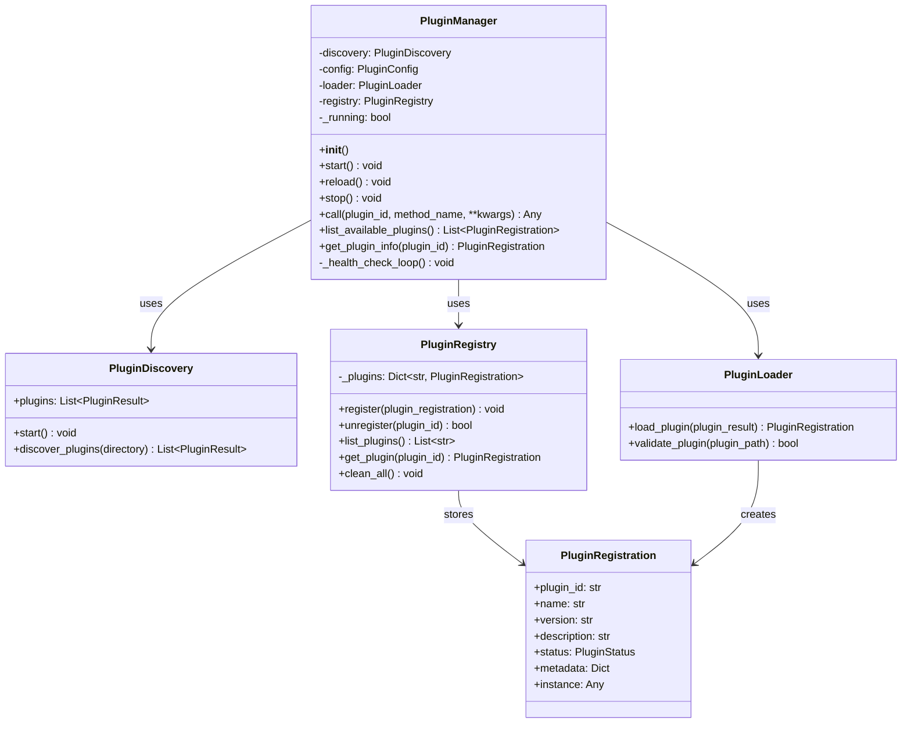

### 插件生命周期管理

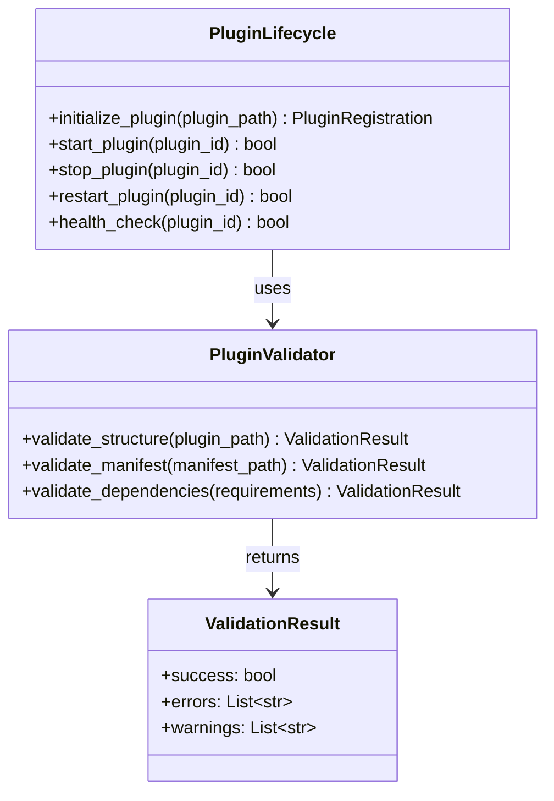

## 📋 任务处理模块

### 任务处理核心类图

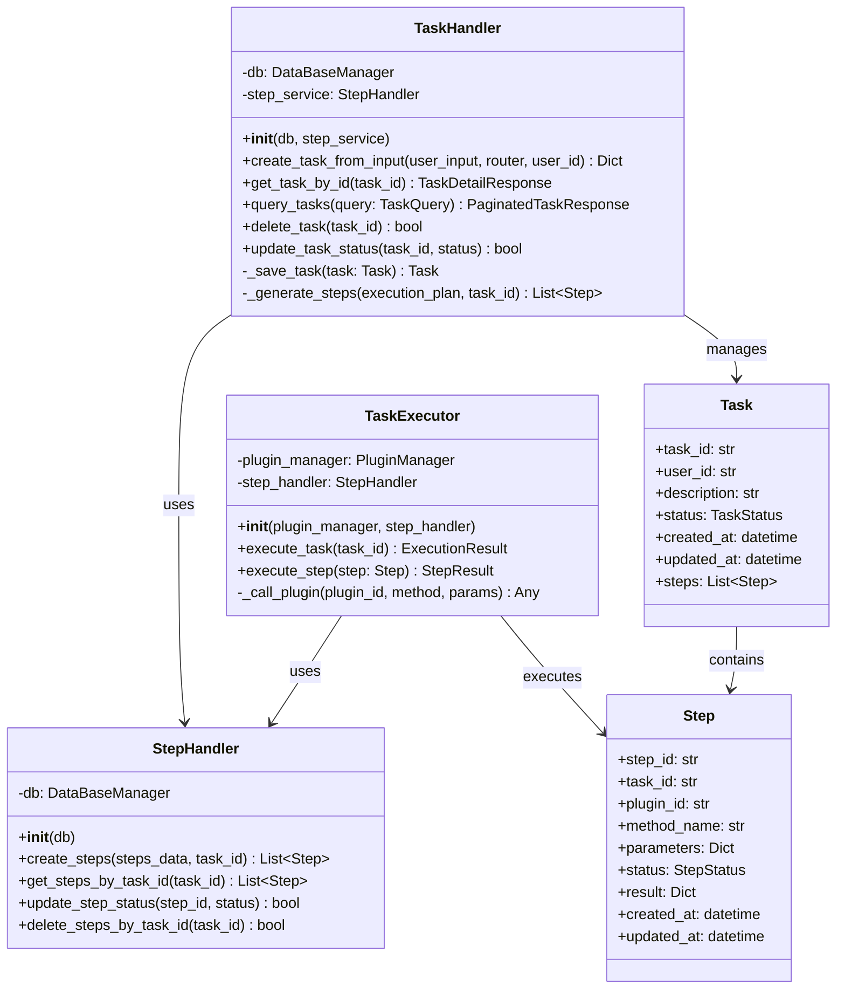

### 任务状态管理

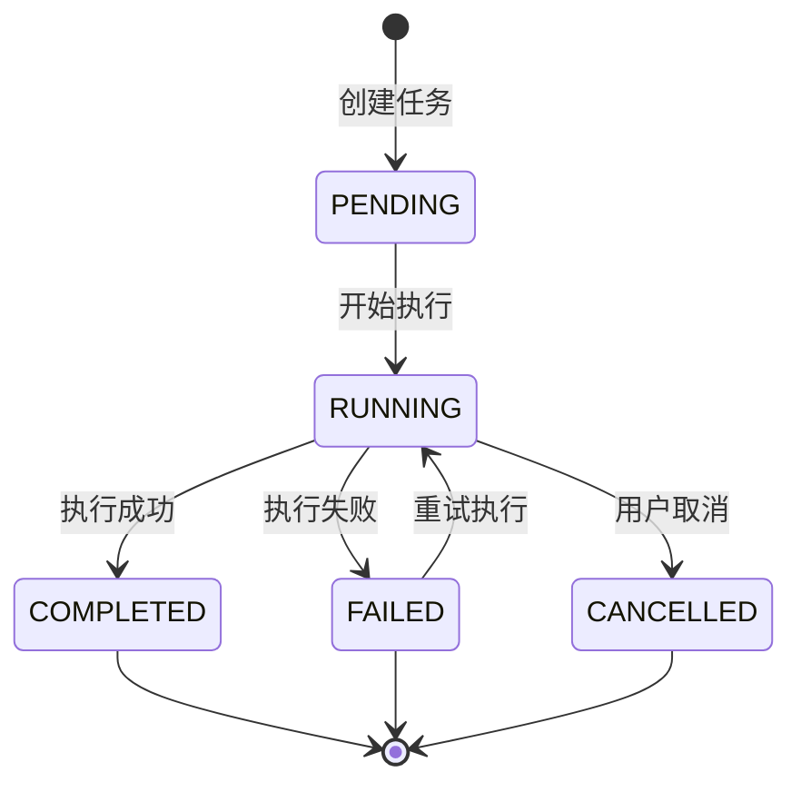

## 📡 MCP 协议模块

### MCP 通信类图

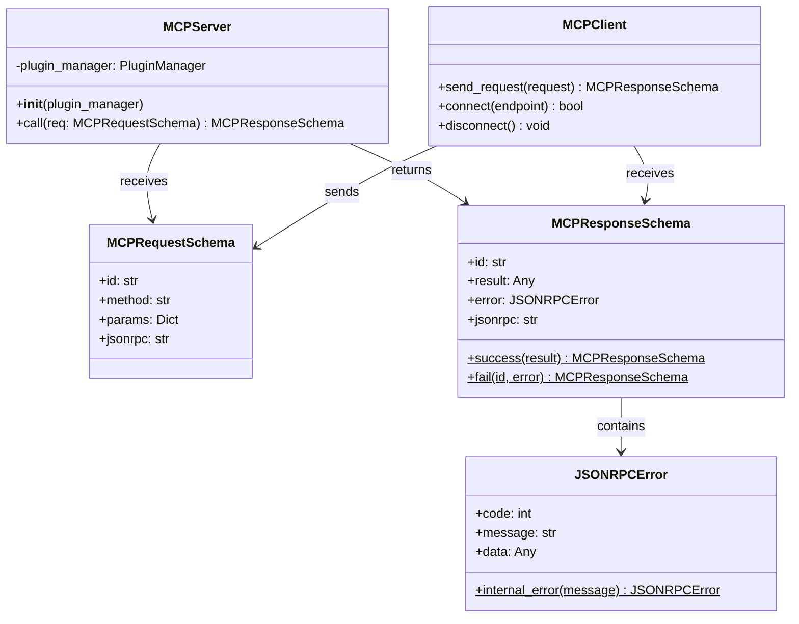

## 🌐 API 接口层

### API 路由类图

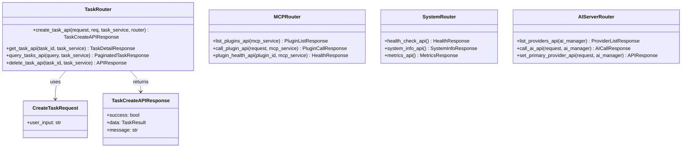

## 🔧 配置管理模块

### 配置系统类图

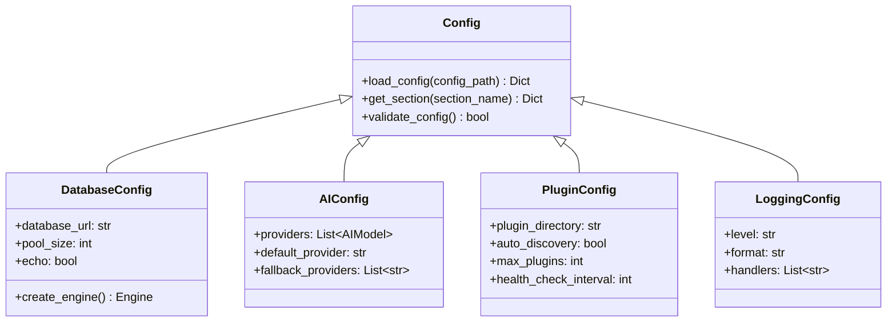

## 🏗️ 依赖注入系统

### DI 容器类图

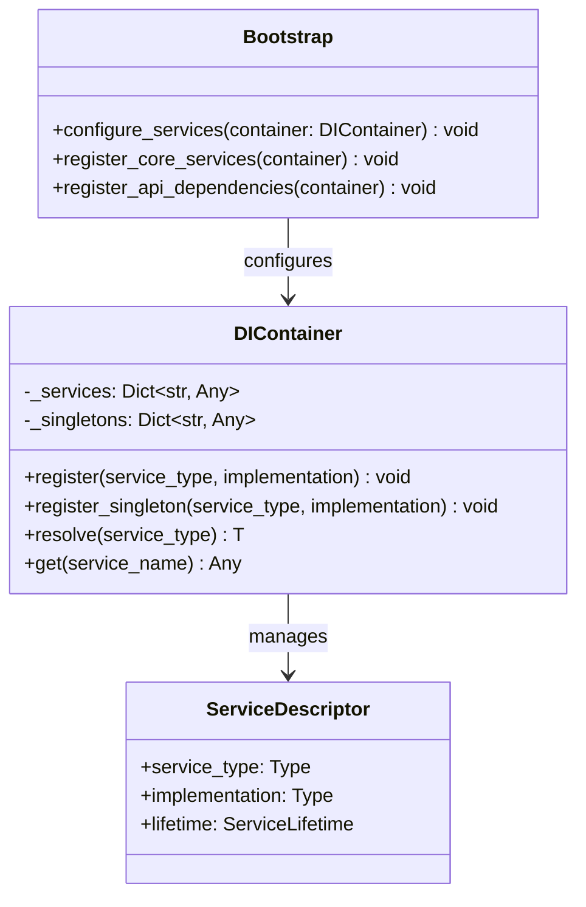

## 📊 整体系统架构关系图

### 模块间依赖关系

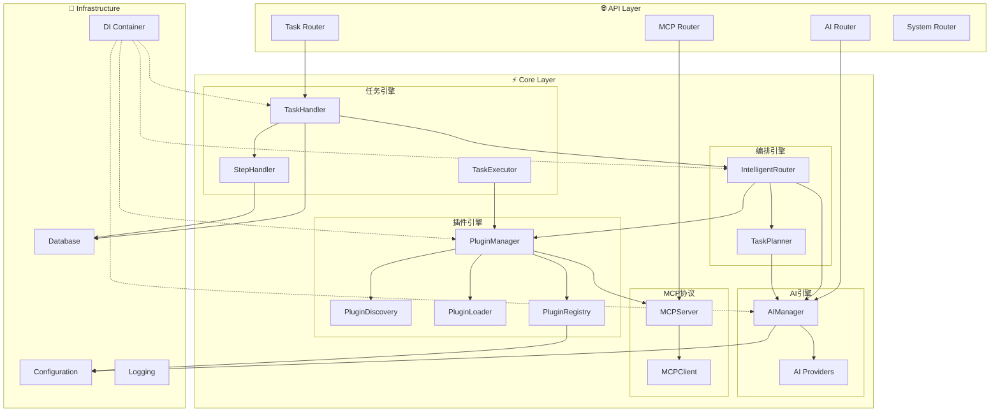

## 🔍 架构优化建议

### 1. 潜在问题识别

**耦合度问题**：
- `IntelligentRouter` 直接依赖具体的 `PluginManager` 和 `AIManager`
- `TaskHandler` 与数据库层耦合较紧

**单一职责问题**：
- `PluginManager` 承担了太多职责（发现、加载、注册、调用）
- `AIManager` 同时管理配置和调用逻辑

### 2. 优化建议

**解耦建议**：
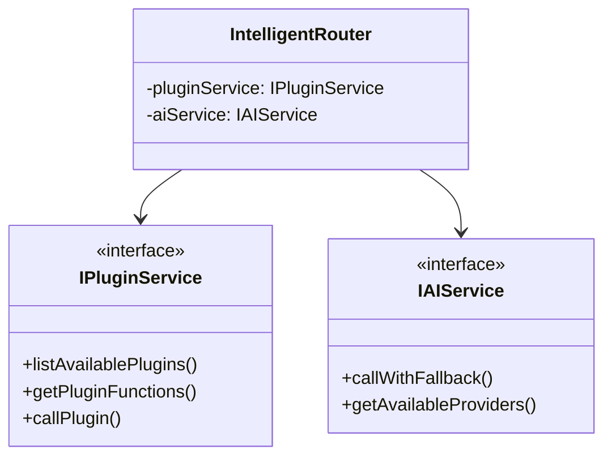

**职责分离建议**：
- 将 `PluginManager` 拆分为 `PluginService` 和 `PluginLifecycleManager`
- 将 `AIManager` 拆分为 `AIConfigManager` 和 `AICallService`
- 引入 `Repository` 模式分离数据访问逻辑

### 3. 性能优化点

- 插件调用异步化
- AI Provider 连接池管理
- 任务执行状态缓存
- 配置热重载机制

---

*此文档基于当前代码结构生成，建议定期更新以保持同步。*